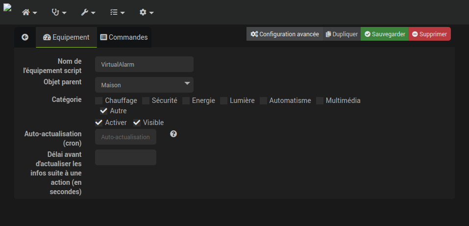
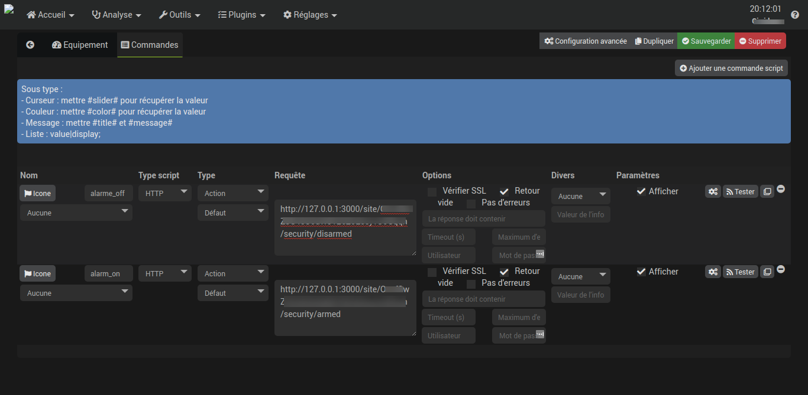

# SomfyAPI

Rest API for Somfy Home Protect

Install [NodeJS](https://nodejs.org/en/download/) 
 
## Setup

Copy `conf.template.json` to `conf.json` and complete data:

    {
      "server": "http://127.0.0.1",
      "port": 3000,
      "username": "my.somfy@account.com",
      "password": "myPassword"
      "client_id": "xxxxxx",
      "client_secret": "xxxx"
    }

For `client_id` and `client_secret`, see https://github.com/Mystikal57/Somfy_Home_ALARM_API/issues/2

Then:

    $ npm install
    $ npm run start

Now explore the [API](./API.md)

### Install as a service

Create in the code root folder a file named `somfy-api.service` and modify this sample according to your installation path

    [Unit]
    Description=Somfy API
    
    [Service]
    ExecStart=/usr/bin/node dist/src/index.js
    Restart=always
    User=pi
    Group=pi
    Environment=PATH=/usr/bin:/usr/local/bin
    Environment=NODE_ENV=production
    WorkingDirectory=/home/pi/workspace/SomfyAPI
    StartLimitBurst=0
    [Install]
    WantedBy=multi-user.target

Then enable it and start it:

    $ npm run build
    $ sudo systemctl link ./somfy-api.service
    $ sudo systemctl enable somfy-api
    $ sudo systemctl start somfy-api
    $ journalctl -f -u somfy-api.service
    
### Update

    $ git pull origin main
    $ npm run build
    $ sudo systemctl restart somfy-api

## With Jeedom

First install this server somewhere (ideally on the same server as Jeedom, I assume that is the case) and start it as a service.

You will need you site Id : 

`http://<ip of you jeedom server>:3000/sitepretty`

In most cases, there is only one site in the response:

    [
        {
            "Maison": "<site id>"
        }
    ]
    
Then use the [Jeedom script plugin](https://doc.jeedom.com/fr_FR/plugins/programming/script/)
and create a virtual device:

Then, add two commands:

with those urls:

- Turn alarm on: `http://<ip of you jeedom server>:3000/site/<your site id>/security/armed`
- Turn alarm off: `http://<ip of you jeedom server>:3000/site/<your site id>/security/disarmed` 

> You can use `armed`, `partial` and `disarmed`

That's all, you can now use this virtual device in your scenarios.

To fetch the state, you can call `http://<ip of you jeedom server>:3000/site/<your site id>/security/state`: 

    {
        "status": "disarmed"
    }

## Contribute

Contribution via pull requests are welcome. 

## Great thanks to

- https://github.com/Mystikal57/Somfy_Home_ALARM_API
